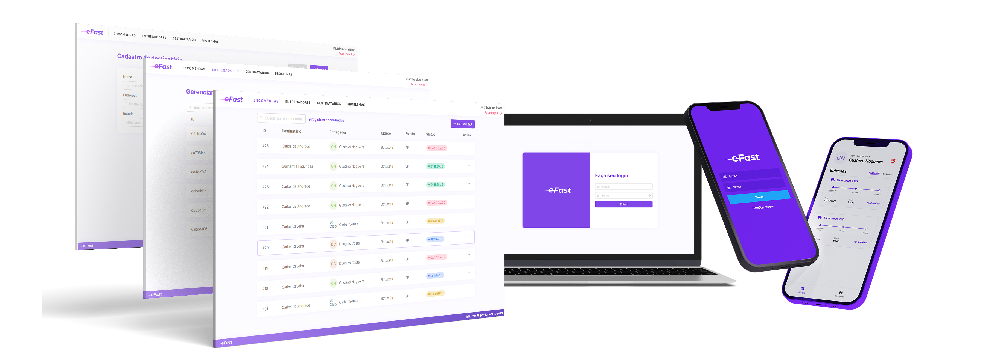

<h1 align="center">
  
</h1>

<h1 align="center">
  eFast - FATEC TCC Project 2022
</h1>

  
  <!--  -->

Complete delivery management application developed as a personal project and utilized for the TCC (Course Completion Work) at Fatec Botucatu - 2022. ©

Developed by: Gustavo Henrique Nogueira

  <a href="#about-the-project">About the Project</a> •
  <a href="#article">Article</a> •
  <a href="#technologies">Technologies</a> •
  <a href="#necessary-configurations">Necessary Configurations</a> •
  <a href="#license">License</a> •
  <a href="#author">Author</a>

---

# 📎 Useful Links

- A guide on how to install and run the project is available in [installation](SETUP.md).
- Development tasks, backlog, ideas and pending work items are listed in [todos](TODO.md).

---

# 📝 About the Project

The year 2019 was dominated by the emergence of COVID-19, leading to one of the most impactful pandemics since the Spanish flu in the 20th century. Social isolation became pivotal globally to curb the virus's spread, causing severe economic disruptions. Many businesses faced bankruptcy or closure due to unprepared logistical operations amidst the new era of social distancing. Searches for deliveries surged exponentially on Google® and Twitter®, becoming some of the most sought-after topics worldwide.

In response to this scenario, this article analyzed and developed a SaaS (Software as a Service) business model, creating a comprehensive application consisting of a web platform and a mobile application, both communicating via API. The aim was to facilitate connections between companies and the delivery of their products to end customers. JavaScript, via the Node.js platform, and abstractions like React were utilized for UI development. The architecture demonstrated enhanced fluidity in communication between managers and couriers, functioning as a facilitator for parcel deliveries.

## 📝 Article

- The article published at [Jornacitec](http://www.jornacitec.fatecbt.edu.br/) is available in Portuguese, and can be found in full [here](https://drive.google.com/file/d/1ZLpfaVJJhmsL3ltrBtRO4KX4cV1FRqan/view?usp=drive_link).

## 🚀 Technologies

- **Backend:** Node.js • Express • Sequelize
- **Frontend:** React • Redux • Styled Components
- **Mobile:** React Native • Redux • React Native CLI
- **Other:** PostgreSQL • Redis • Nginx • Docker • PM2

## ⚙️ Necessary Configurations

For local deployment and usage of the eFast project, ensure you have the necessary dependencies installed as detailed in [installation](SETUP.md).

## 📄 License

The license governing the use and distribution of this project can be found in full [here](LICENSE).

## 👨‍💻 Author

- Gustavo Henrique Nogueira
- GitHub: [gu-nogueira](https://github.com/gu-nogueira)
- Email: [gus.h.nogueira@gmail.com](mailto:gus.h.nogueira@gmail.com)

Feel free to modify or expand this README to better suit the specific details and requirements of your eFast project. Add relevant sections, screenshots, or links as needed to provide comprehensive information to users and contributors.
